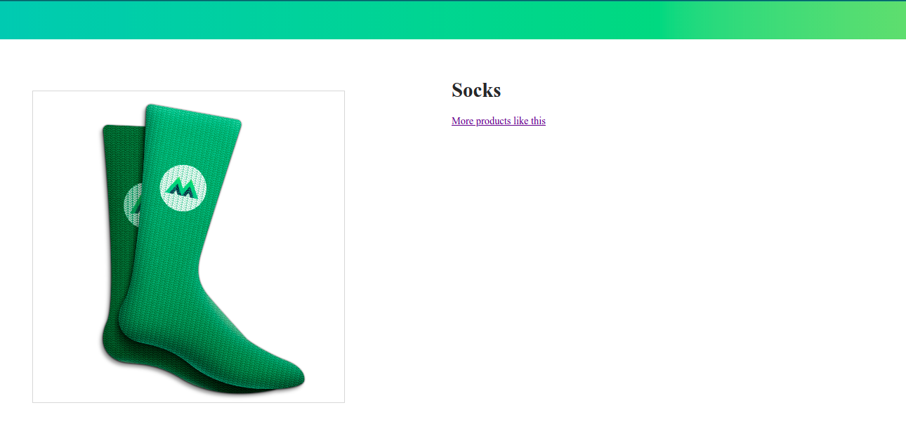

# VueJs
Es un framework de JavaScript para la construcción de interfaces de usuario y aplicaciones de una sola página.

# Primer Lección
En index.html agrego una imagen, info y un link.

```
<div class="product-image">
    
</div>

<div class="product-info">
  <h1>{{ product }}</h1>
  <a :href="link" target="_blank">More products like this</a>
</div>
```
Dentro del body.
```
<script src="https://cdn.jsdelivr.net/npm/vue@2.5.13/dist/vue.js"></script>
<script src = "main.js"></script>
```

<p>En main.js:</p>

```
var app = new Vue ({
  el: '#app',
  data: {
      product: 'Socks',
      image: 'assets/vmSocks-green-onWhite.jpg',
      link: 'https://www.amazon.com/s/ref=nb_sb_noss?url=search-alias%3Daps&field-keywords=socks'
  }
})
```
<h2>Vista Previa </h2>
<div align="center"> </div>

## Segunda Lección

Condicionales y listas:
```
<p v-if="inStock">In Stock</p>
<p v-else>Out of Stock</p>
      
<ul>
  <li v-for="detail in details">{{ detail }}</li>
</ul>

<div v-for="variant in variants" :key="variant.variantId">
  <p @mouseover="updateProduct(variant.variantImage)">{{ variant.variantColor }}</p>
</div>
      
<button v-on:click="addToCart">Add to cart</button>
<button @click="removeFromCart">Remove from cart</button>
      
<div class="cart">
  <p>Cart({{ cart }})</p>
</div>
```
Manejo de eventos:

```
<button @click="addToCart">Add to cart </button>
<div @mouseover="updateProduct">Color</div>
<form @submit="addToCart>...</form>
<input @keyup.enter="send">
```

Class and style Bliding:

Agregando estilo a "green" y "blue"

<class = "color-box" :style = "{backgroundColor: variant.variantColor }">
